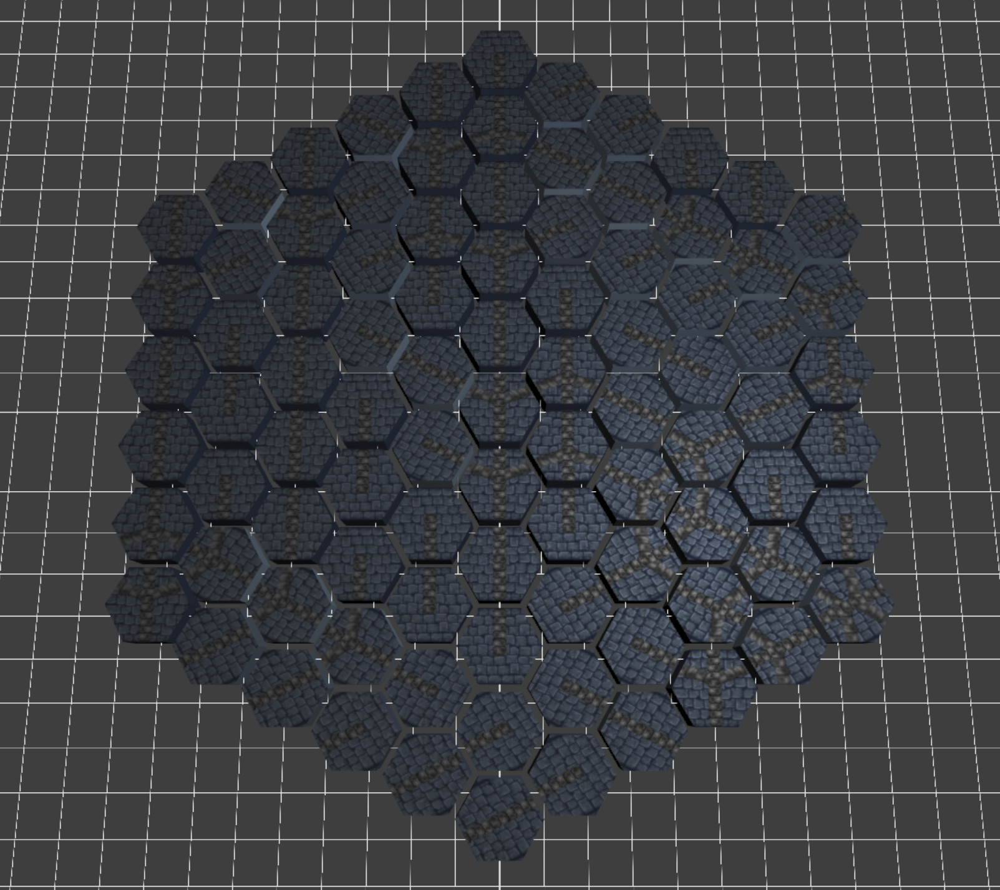
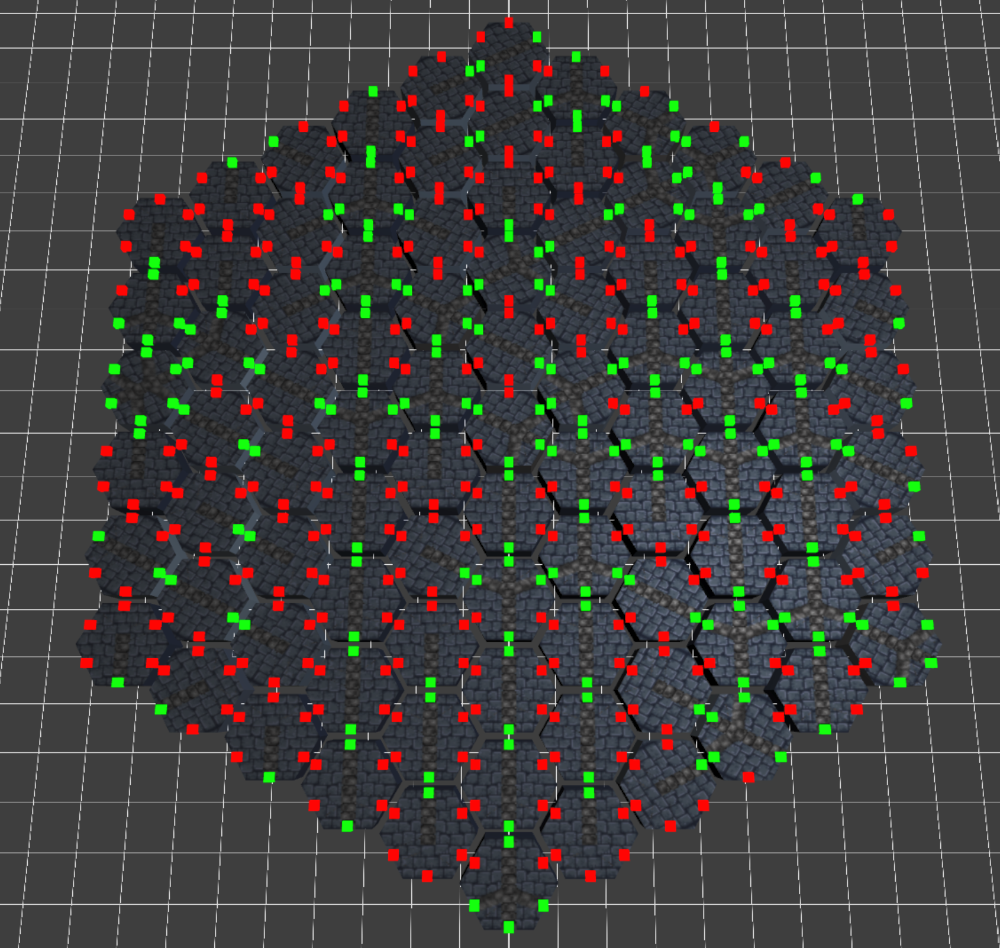
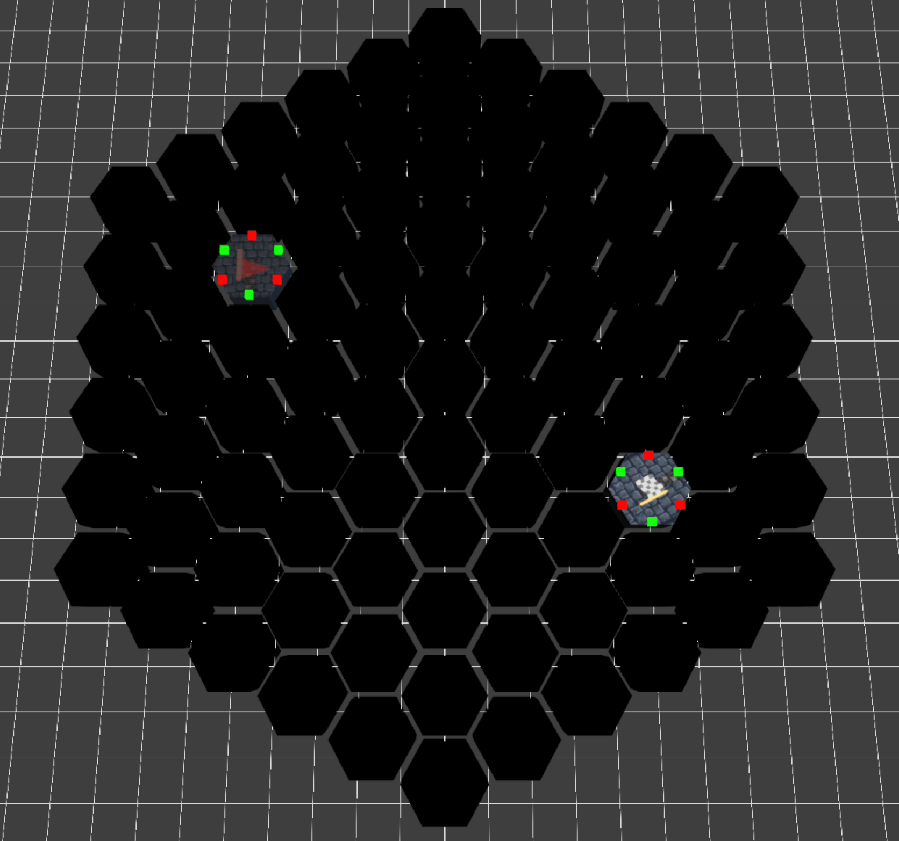
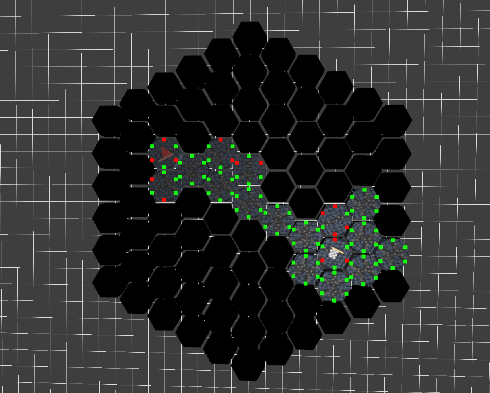
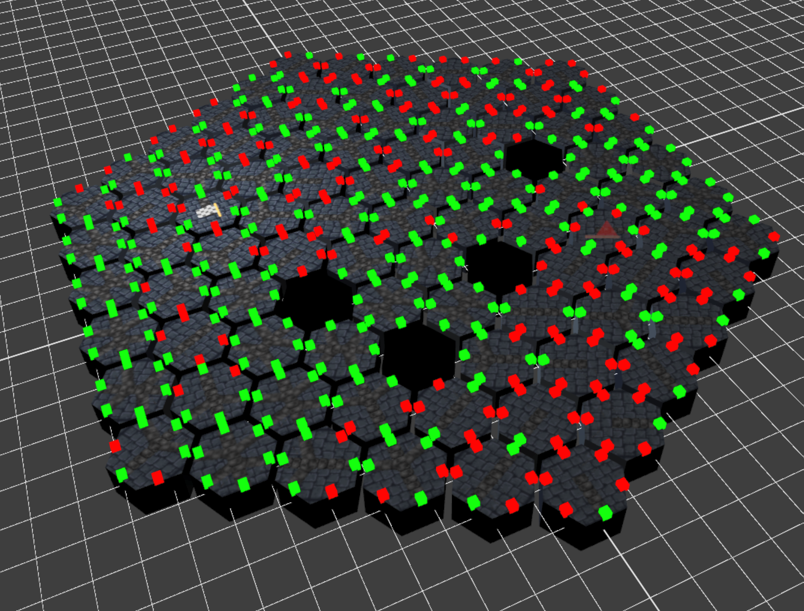

# HexDungeon

#### Introduction
HexDungeon is a WebGL-based dungeon layout builder using Wave-Function Collapse to procedurally build a cohesive dungeon layout.

#### Goal
The goal is to build a foundational map builder to serve as the basis for a future game project in WebGL. The idea is to build the supporting systems for a hex tile, turn-based dungeon crawler with procedurally generated levels.

[Live Demo](https://rubenaryo.github.io/HexDungeon/)

## Final

### Sockets
For the final, I refined the tile definitions and created an explicit socket system for more fine-grained adjacency. The socket system is versatile and can handle automatic generation of new tile variants when rotated, allowing for more open socket permutations.

### Start/End Goals
Moreover, I also implemented a definite start/end goal system, along with the path-finding algorithm that ensures a solution is possible. To implement this, I used a modified Depth-First-Search which picks adjacent tiles at random. This is done purposely because we intentionally do not want the 'shortest path' but actually something more interesting, but still need to guarantee connectivity. 

### Tile Types
I currently define the following tile types:
- Corridor
- Dead End
- T-Junction
- RoomFloor
- Solid
- Start
- End

Each has 6 variants for each possible orientation, and a custom tile texture authored by me that is automatically rotated appropriately in-shader.

### Examples
| | |
|--------|--------|
| Sample generation of a maze with no start/end  | With open/closed sockets visualized |

| | |
|--------|--------|
| Initial state with all hexes uncollapsed  | After running pathfinding and building a path from start to end |

### Pitfalls
As an algorithm, WFC is not guaranteed to generate a valid map on the first attempt when working with finite tile sets. Since each cell is collapsed one-by-one, it is possible to end up with a situation where a cell does not have an available tile to fulfill the adjacency requirements of its neighbors. 

While a fixup pass is possible, in our case we treat uncollapsible tiles as "closed" and are inaccessible for pathfinding.

| |
|--------|
| Some tiles have no available TileDefinitions left.  |

## Milestone 2
For milestone 2, I was able to craft the core wave-function collapse algorithm, as well as improve the camera movement and create some UI buttons. The core algorithm still needs tweaking since each tile type has an equal chance of collapsing into, leading to some strange terrain generation or a bias towards certain tiles. 

## Milestone 1
For milestone 1, I focused on getting a polished hex grid implemented in WebGL with Axial coordinates. I didn't quite get a finished Wave-function collapse implementation finalized, so I will be pushing that back to be the first priority of milestone 2. 

## Design Doc
#### Inspiration/reference:
[Hex WFC Demo on YouTube](https://www.youtube.com/watch?v=XJCmQUnVAsE)

| |
|--------|
| [Link](https://boristhebrave.github.io/DeBroglie/articles/topologies.html)  |

#### Specification:
1. Core: Single-level wave-function-collapse dungeon generator. Creates a single layer of hex grids, spaced apart according to the rules of wave-function collapse
2. Layer-stacking: We can layer these grids on top of each other, intelligently placing traversal points in between them
3. Tile-based movement: A simple player entity can traverse through the level tile-by-tile.

#### Techniques:
- Wave Function Collapse ([Descriptive Repo Example](https://github.com/mxgmn/WaveFunctionCollapse))
- Hex Grid Logic and Indexing ([RedBlob HexGrid Explainer](https://www.redblobgames.com/grids/hexagons/))
- Tile based movement

#### Design:
- The dungeon layout builder is the core of the project. After being given a target dimension by the application, it intelligently places pre-authored tiles according to a (hard-coded) rule-set.
- The application holds the WebGL guts that bind the project together, including the initialization flow which generates the dungeon, and the frame-by-frame flow which orients the game camera and moves the character.

#### Planned Timeline:
May differ from actual results

**Milestone 1:**
- Core WebGL app is up and running, runnable in a browser.
- Core Wave-function collapse algorithm is functional, with basic conceptual tiles placed in a single layer.
- Fixed camera, no input
- Room for bugs

**Milestone 2:**
- Layer stacking is functional, allowing multiple layers to be placed on top of each other.
- Some tiles are properly authored
- Beginnings of player movement and rotating camera.
- Bugfixing and polish

**Final**
- Polish and bugfixing